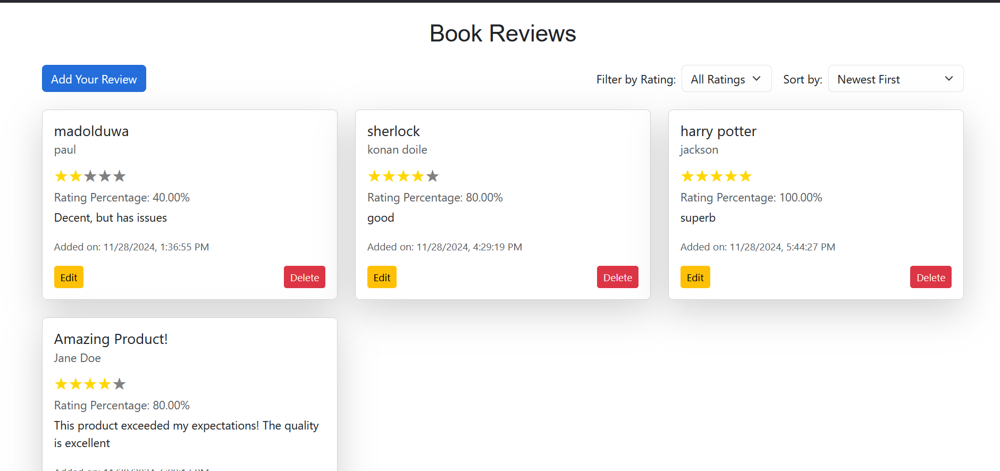
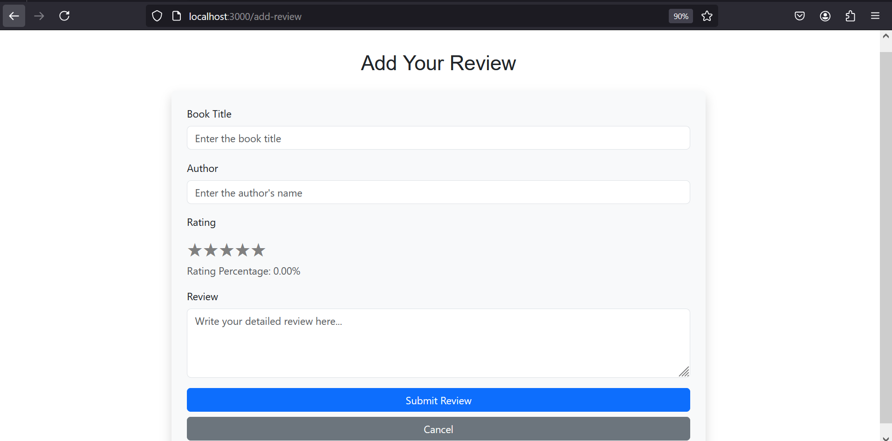
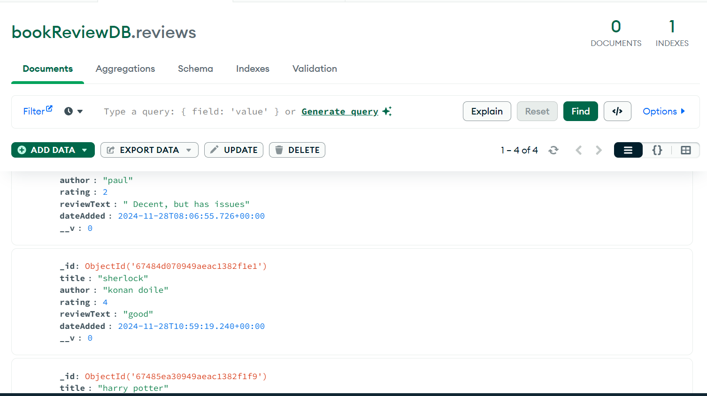

# **Book Review Web App**

A simple **MERN stack** application for users to write, view, edit, and delete book reviews.

---

## **Features**
- Add a book review with a title, author, rating, and review text.
- Edit or delete existing reviews.
- Filter reviews by star rating.
- Sort reviews by newest, oldest, or highest rating.
- Responsive and user-friendly interface.

---

## **Screenshots**

### Home Page


### Add Review Page


### Edit Review Page


---

## **Setup Instructions**

### **Prerequisites**
1. **Node.js** (v14+)
2. **MongoDB** (for local development, ensure MongoDB Compass is installed)
3. **Git**

### **Clone the Repository**
```bash
git clone https://github.com/CodeMaestro2001/book-review-app.git
cd book-review-app
